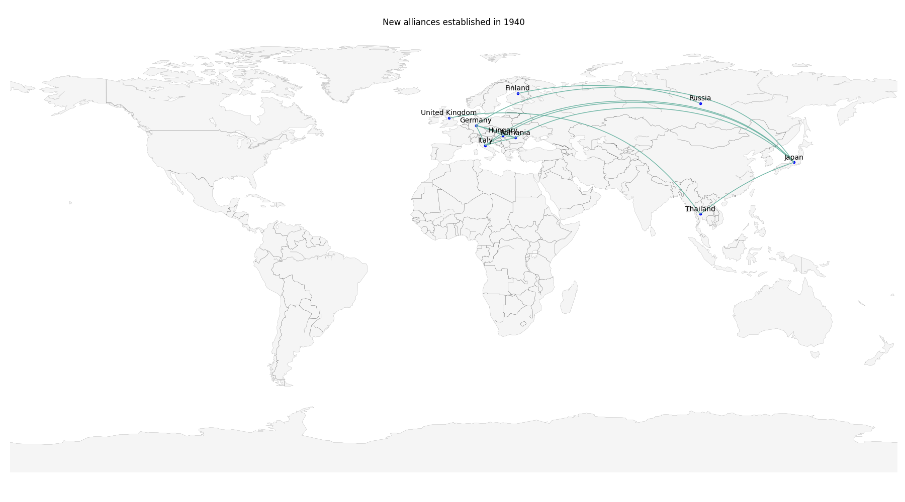

# Formal Alliances

### Generate plots showing formal alliances of countries/regions between 1816 and 2012
Run the nodebook `alliance.ipynb` to plot the new alliances established in a year. 



### Citations
The dataset was downloaded from [Correlates of War, Formal Alliances (v4.1)](https://correlatesofwar.org/data-sets/formal-alliances/).

```
Gibler, Douglas M. 2009. International military alliances, 1648-2008. CQ Press.  

The original alliance data set was assembled in the 1960s under the auspices of the COW project and was initially discussed in:

Singer, J. David, and Melvin Small. 1966. “Formal Alliances, 1815-1939.” Journal of Peace Research 3:1-31.

The data were extended in:

Small, Melvin, and J. David Singer. 1969. “Formal Alliances, 1815-1965: An Extension of the Basic Data.” Journal of Peace Research 6:257-282.
```