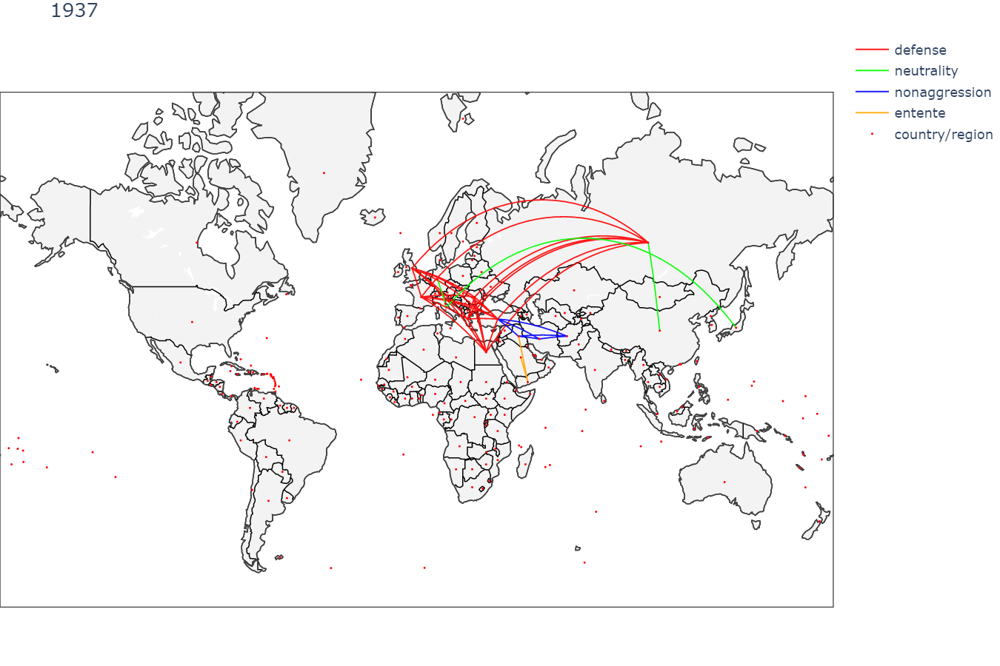

# Formal Alliances

### Environment setup
Python==3.8.5
```
pip install matplotlib==3.6.2 pandas==1.4.4 numpy==1.23.1 thefuzz==0.19.0
pip install plotly==5.11.0
pip install -U kaleido==0.2.1
pip install jupyterlab==3.3.2
pip install notebook==6.4.10
```

### Generate plots showing formal alliances of countries/regions between 1816 and 2012
Run the nodebook `alliances_plotly.ipynb` to plot the new alliances established in a year. 




__Please play with this [interactive map](https://htmlpreview.github.io/?https://github.com/ECE-143-FA-2022/Alliance/blob/main/plotly/all_fig.html) displaying alliances, which is generated by the nodebook `alliances_plotly.ipynb`.__

### Citations
The dataset was downloaded from [Correlates of War, Formal Alliances (v4.1)](https://correlatesofwar.org/data-sets/formal-alliances/).

```
Gibler, Douglas M. 2009. International military alliances, 1648-2008. CQ Press.  

The original alliance data set was assembled in the 1960s under the auspices of the COW project and was initially discussed in:

Singer, J. David, and Melvin Small. 1966. “Formal Alliances, 1815-1939.” Journal of Peace Research 3:1-31.

The data were extended in:

Small, Melvin, and J. David Singer. 1969. “Formal Alliances, 1815-1965: An Extension of the Basic Data.” Journal of Peace Research 6:257-282.
```